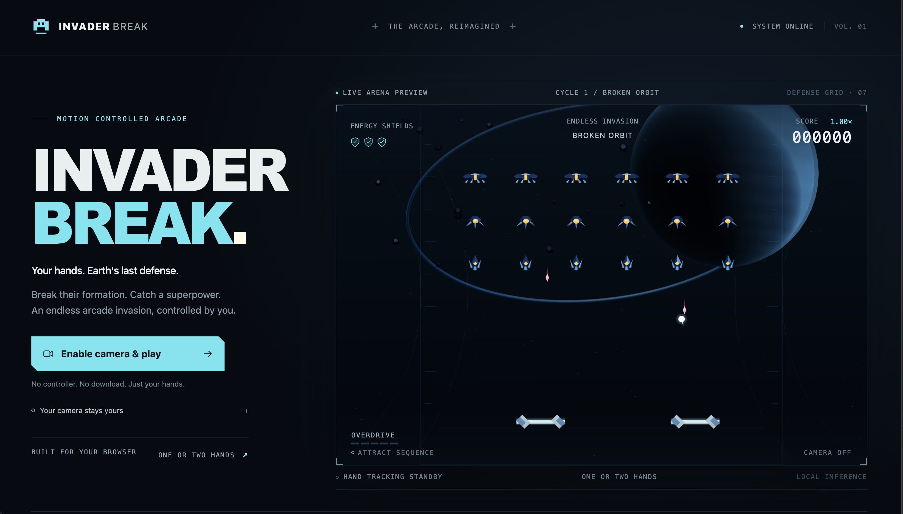
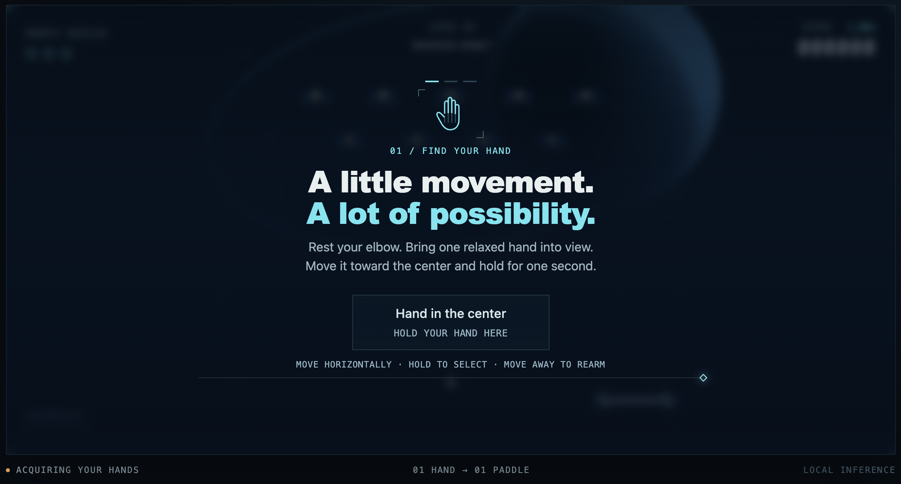

[Play the game](https://game-invader-break.vercel.app/)

# Invader Break

Created with **GPT-6 ASTRA**.

A browser arcade game combining ball-breaking combat with an attacking invader fleet. Your camera tracks your hands: one hand controls a full paddle; two hands control two wider, independent paddles. Protect three shared energy shields across endless levels, with an Eclipse Engine boss every seventh level and increasing difficulty.

## Play locally

Requires Node.js 20.18+ and a current desktop browser with WebGL 2 and a camera.

```sh
npm ci
npm run assets:prepare
npm run dev
```

Open the local URL printed by Vite. Click **Enable camera & play** to grant camera access and enable audio. Gameplay uses hand position:

1. Hold a relaxed hand in the center; calibrate a comfortable left and right reach.
2. The game starts automatically after calibration with recommended defaults and a short launch countdown. No practice or setup menus to complete.
3. Move horizontally to steer. Add a second hand for two wide paddles and a 1.5× score bonus while both hands are active.
4. After a run, hold over a menu option for one second to retry or adjust settings; move away before selecting again.
5. Remove your hands to pause. Return and hold in the center to continue.
6. Click **Disconnect camera** in the bottom camera panel at any time to stop the camera, quit the run, and return to the start screen.

New players start with comfortable reach, automatic one-/two-hand switching, music at 30%, and sound effects at 65%. Saved preferences and your system’s reduced-motion preference are respected. Text is larger throughout; an additional Large text option remains in settings.

Destroyed invaders can drop glowing power capsules. Catch them with either paddle:

- **Giant Ball (G):** a larger ball for 30 seconds.
- **Wide Paddles (W):** 50% wider paddles for 30 seconds.
- **Multiball (M):** up to three balls for 30 seconds.
- **Fireball (F):** balls pierce and destroy invaders for 30 seconds.
- **Shield Repair (+):** immediately restores one shield, up to three.

Different powers stack; repeat pickups refresh their timer. Timers count active combat only and freeze during pauses, serves and level breaks. During multiball, losing a ball costs no shield while another remains. Enemy body hits, enemy shots and losing the last ball cost one shield. Five precision catches still trigger Overdrive.

An original synthesized soundtrack starts after camera activation, with quieter music during menus and pauses. Adjust music and effects separately in settings; disconnecting stops audio and camera access.

Levels continue after every boss. After each five completed levels (at levels 6, 11, 16, and onward), balls, formations, shots and dives speed up and attacks become more frequent. Later increases become smaller to preserve playable speed limits; enemy durability still grows across invasion cycles.

From level 3, lancers and lingering drones break formation into swooping or weaving dives. An amber path warns of their fixed route before launch. Surviving invaders turn around at paddle height and retrace the same curve back to their launch position, then resume formation movement. The path marker shows their destination on each leg. Shoot them down with the ball or move clear: a body impact on either leg destroys the invader and costs one shield, with the usual brief damage protection. Ramming earns no points or power drops. Only one invader flies at a time, including its return, and attack checks preserve a reachable ball-catching route. Flight freezes when tracking pauses and during recovery serves.

Local records distinguish one-hand, two-hand and mixed-control runs, save the highest level reached, and retain progress when you disconnect.

The camera model runs locally in a worker. No microphone, camera recordings, landmark storage, accounts or game-data uploads. The upstream SDK privacy notice and this build's network restrictions are explained before camera activation.

## Verify and build

```sh
npm run format:check
npm run lint
npm run typecheck
npm test
npm run test:browser
npm run assets:verify
npm run build
npm run preview
```

Browser tests require Playwright Chromium (`npx playwright install chromium` if absent). They use a development test server at port 4175 with live reload disabled and a production preview at port 4176. Most control tests use synthetic camera observations; the production check exercises the real camera scheduler and ML worker with a test video stream. Synthetic controls are never included in the production entry. Tests do not establish physical hand-tracking latency or human playability.

`npm run build` automatically prepares and verifies the camera assets before compiling. Model files and the generated runtime are intentionally not committed: preparation copies the pinned MediaPipe runtime from `node_modules`, downloads the pinned hand model from Google Storage when absent, and verifies its SHA-256. A fresh build therefore needs network access to download the model. Local development still needs the explicit `npm run assets:prepare` step above.

`dist/` is the static build. Serve on HTTPS (localhost works for development), with the security headers from `public/_headers` applied to **all responses, including workers**. `_headers` is a hosting convention; configure equivalent headers if your host does not interpret it. Subdirectory hosting is not configured. Public deployment is not part of this delivery.

### Vercel build settings

Use the **Vite** framework preset, the repository root as the root directory, `npm ci` as the install command, `npm run build` as the build command, and `dist` as the output directory. The build prepares the camera assets even on a fresh checkout with no build cache.

## Design and evidence

- [Design package](docs/README.md)
- [Validation and remaining qualification](docs/validation/README.md)
- [Implementation baseline](docs/decisions/development-baseline.md)
- [Asset provenance](docs/assets/manifest.md) and [third-party notices](THIRD_PARTY_NOTICES.md)

The game is an implemented local candidate. Real-camera qualification on Windows/macOS, a one-person pilot, physical latency measurements, and final commercial art/audio acceptance remain pending. Procedural art follows the design direction; this is not a claim of completed AAA production. The originally requested development-rules directory was unavailable.
