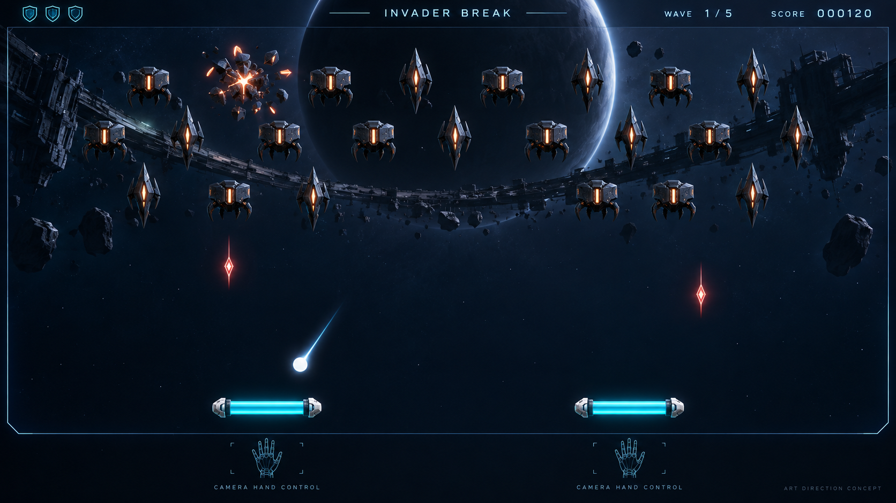

> Implementation is now available. See the [project README](../README.md) for launch instructions and [candidate validation](validation/README.md) for evidence and remaining qualification. The documents below retain the original design proposal.

# Invader Break — design package

**Recommendation:** a fixed-view 2.5D arcade game where sculpted alien formations attack while the player uses camera-tracked hands to return a plasma ball. One hand moves an 18%-width paddle; two hands each move a 13.5%-width paddle. Both share three energy shields.

Research and design date: 2026-09-16. This package contains research, proposed rules, two generated graphic concepts and a development plan. It contains no game implementation.

## Read the package

| Document | What it answers |
| --- | --- |
| [Game design](superpowers/specs/2026-09-16-invader-break-design.md) | Rules, one/two-hand behavior, shields, ball loss, enemies, boss, scoring, onboarding and success criteria |
| [Art direction](art/art-direction.md) | Visual concepts, materials, silhouettes, animation, effects, UI, sound and production budgets |
| [Development plan](superpowers/plans/2026-09-16-invader-break-development-plan.md) | Architecture, future module boundaries, tasks, validation gates, staffing and timeline assumptions |
| [Research brief](research/research-brief.md) | Source-linked game comparisons, browser/ML evidence, Motion Fighter reuse map and missing rules |
| [Concept prompt record](art/image-prompts.md) | Exact prompts and image-generation provenance |

## The proposed experience

Play a 5–8 minute run through six formation waves and the Eclipse Engine boss. Aim by choosing where the ball meets the paddle. Destroy charging enemies before they fire, bank around armor, and earn automatic Overdrive with five accurate center returns. Extra gestures are unnecessary.

Two hands offer separated coverage, with a real gap between the halves. Overlap never creates extra collision area or double damage. Hand identity persists through crossings; loss or ambiguity pauses the game rather than taking shields.

Start with exactly three shared shields. Enemy projectile or body contact costs one. The proposed additional rule is that a missed ball also costs one; this is explicitly a design assumption for review. A shared one-second damage grace period prevents a burst of simultaneous contacts from ending the run.

The attack director must leave reachable catches instead of forcing the player to choose between two unavoidable losses. Fairness and input responsiveness are the first milestones.

## Visual target

**Concept art, not a game screenshot.** The second [visual development board](art/concepts/invader-break-visual-development.png) explores enemy silhouettes, the boss, paddles and materials. Illustrative HUD values do not override the written rules.

Aim for premium presentation through authored 3D forms, dark ceramic armor, warm alien cores, cool energy shields, restrained lighting and strong animation/audio. Keep the white ball and hostile shot silhouettes readable. “AAA” is an art ambition; no rendering performance or finished-build quality is claimed.

## Findings that change the development approach

- Motion Fighter tracks **body pose and wrist points**, not the full hand skeleton. Reuse its camera/worker lifecycle patterns and replace the model/contracts with a dedicated 21-landmark hand pipeline.
- Camera frames should remain local. Browser permission and audio activation may require an initial click/tap; gameplay and subsequent menus use hand position.
- Prototype real two-hand inference while rendering representative effects. Separate ML and graphics benchmarks can hide competition for device resources.
- Validate the graybox before producing the full asset set. The provisional 12–18 week release range assumes two engineers, an experienced 3D artist and part-time technical art, sound and QA—not a solo schedule.

## Scope and provenance

Desktop/laptop first is the working assumption; phone/tablet support has not been promised. No global leaderboard, multiplayer or alternate combat input is included.

The requested /home/cyngn/sing/agent-dev/rules and likely Mac equivalent were unavailable. The plan uses the documented Motion Fighter baseline provisionally and makes no conformity claim. The original rules must be reconciled when available.

The main defaults to review are platform scope, ball-loss damage, session length, visual direction and production budget. Implementation remains a separate requested step.

The [September 17 usability update](validation/2026-09-17-usability-update.md) supersedes the original design’s practice/menu onboarding, split-paddle width, and camera-exit controls.

The [endless powers update](superpowers/specs/2026-09-17-endless-powers-design.md) supersedes the original finite-run rules with recurring bosses, five collectible powers, background music and two-hand bonus scoring. See its [validation evidence](validation/2026-09-17-endless-powers.md).
