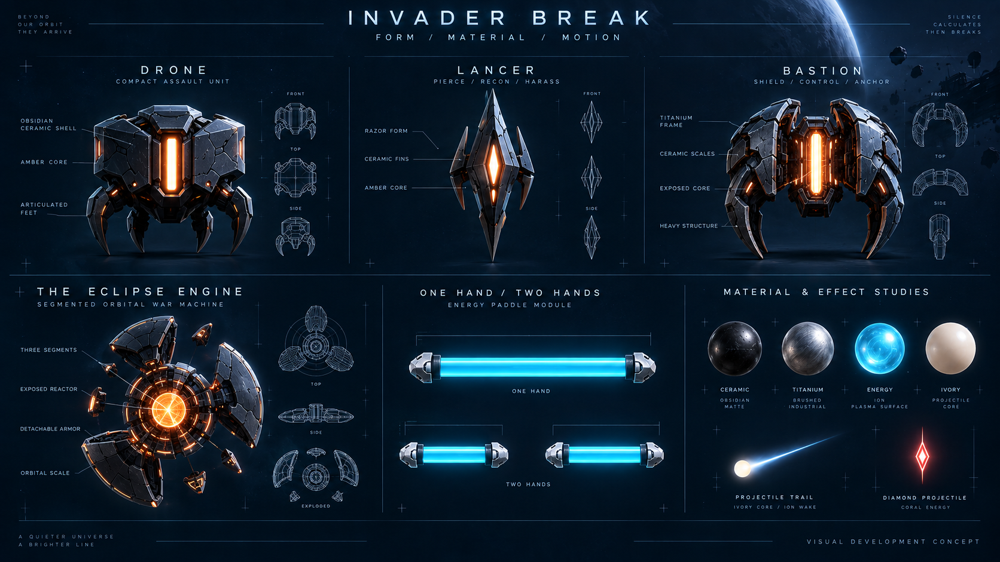

# Invader Break — art direction and production brief

Date: 2026-09-16. Visual target for a proposed game, not evidence of implemented rendering.

## 1. Direction: monumental space, precise play

Build a small, beautifully authored combat stage within an enormous implied world. The active game uses a stable front-facing plane. Sculpted alien machines sit on that plane; depth, parallax and grandeur belong to the space behind them.

The signature contrast is **warm alien cores inside black ceramic armor, opposed by cool cyan energy held in pale titanium paddles**. A nearly white plasma ball cuts between them. The mood is tense and elegant, with impact coming from selective brightness, weight and timing.

The artwork should look expensive because its shapes, lighting and materials are intentional. Bloom alone cannot achieve this. Every enemy needs a strong silhouette before surface detail. Every hit needs animation and audio before more particles.

## 2. Visual concepts

### Gameplay target

This concept establishes the overall hierarchy: aliens above, open travel space, one brilliant ball, two isolated shield paddles, and three shared shield icons. It also establishes the eclipsed planet and broken orbital architecture.

**Production adjustments:** reduce background detail behind enemy silhouettes; enforce the specification's exact 18%/9% paddle widths; scale the hand inset down during live play; replace illustrative HUD counters with live data. The displayed wave count is concept copy, not the planned number of waves. The long ball trail should shorten at low speed.

### Form and material board

The board explores Drone, Lancer, Bastion, the Eclipse Engine, a full paddle splitting into halves, and shared materials. Extra decorative annotations are mood-board copy, not mechanics. Orthographic turnarounds and skeleton lines are illustrative; an artist must produce dimensionally consistent production assets.

Both images were made with the built-in image-generation tool. The second uses the first as an art-direction reference. [Exact prompts](image-prompts.md) are recorded. These flattened images are not production meshes, texture atlases, sprites, gameplay UI, or animation frames.

## 3. Color and luminance system

| Role | Starting color | Rule |
| --- | --- | --- |
| Deep space | #050B17 | Quiet baseline, no busy noise behind the ball |
| Distant atmosphere | #162D45 | Depth without taking foreground contrast |
| Friendly shield | #4DE9FF | Clear collision face; most bloom stays close to the surface |
| Ball core | #FFF9E9 | Brightest sustained gameplay element |
| Enemy reactor | #FFB35B | Warm pinpoint energy inside darker silhouettes |
| Hostile projectile | #FF657A | Diamond body and downward motion, not color alone |
| Titanium | #C3D4DD | Grounded mechanical mass |
| Secondary sector accent | #8D7DDA | Background-only accent in the final sector |

These values are initial art swatches, not calibrated contrast guarantees. Test actual tone mapping and display brightness.

The order of attention is ball → imminent hostile threat → paddle surface → enemy vulnerability → score feedback → environment. Brief hits may peak brighter than the ball, but should remain local and short. Maintain crisp cores even when effects are reduced.

Hostile shots need a filled or strongly outlined diamond, a short downward tail and a specific sound. The friendly ball stays circular. Friendly particles cannot resemble an extra ball; debris cannot resemble a hostile projectile.

## 4. Asset shape language

**Drone:** compact, broad ceramic shell with a simple rectangular reactor. Four short feet establish an alien silhouette without adding noisy animation. At gameplay scale, the core and three major armor planes must read.

**Lancer:** a tall, narrow spear with two swept fins. Its windup brings the fins inward and concentrates the core before a dive. The silhouette announces its direction.

**Bastion:** a heavy horseshoe framing an exposed center. Use two visibly separate armor states; the first hit removes a real plate instead of changing a hidden hit counter. Its front shield must read from the combat view.

**Spitter:** three prongs around an emitter. The prongs spread during charge, then snap inward on firing. The shot's diamond is visible before it leaves the muzzle.

**Conductor:** a forked vertical frame with small orbiting plates. Its pulse travels to affected neighbors as thin local lines that fade before projectiles enter the catch region.

**Eclipse Engine:** three radial armor petals around a central reactor. Each petal has a distinct break silhouette. Its immense scale comes from layered panels and slow rotation of background mechanisms, while the actual hit areas remain fixed and legible.

Avoid requiring the player to distinguish enemies by small decals, subtle roughness changes, or similar shades. Inspect black silhouette sheets at 48-pixel enemy height before approving high-detail assets.

## 5. Paddle and ball design

The paddle is an energy face suspended between two titanium endcaps. Give it a flat, visible upper collision edge. A collision ripple travels along the surface on every return, then settles quickly. Paddle movement has a restrained trailing shimmer; the leading edge remains sharp.

In two-hand mode, the halves are physically separate. Never draw a connecting beam across the gap, because players would read it as a collision surface. Track identity can use a small solid-ring or split-ring badge beneath each half.

In one-hand mode, the full paddle looks like the same object assembled into one span. Split/merge animations disassemble and re-form the endcaps in a paused state. Do not simulate a physical explosion or imply temporary invulnerability is earned through hand tricks.

The ball is an ivory core surrounded by a thin cool halo. Its trail encodes direction, not a damaging tail. Trail length grows modestly with speed and is reduced near the paddle. Overdrive adds a tight second ring and tonal change, not a screen-sized aura.

## 6. Animation and effects vocabulary

| Event | Motion and effects | Starting duration |
| --- | --- | --- |
| Normal paddle return | Local surface dent/ripple, tiny sparks, crisp tonal tick | 100–180 ms |
| Precision return | Narrow center ring and charge-meter pulse | 180–250 ms |
| Armor hit | Plate recoil, warm fissure, two or three solid fragments | 150–300 ms |
| Enemy kill | Core collapse, 6–12 major fragments, sparse particles | 350–650 ms |
| Enemy windup | Shape change, localized core pulse, lane marker | At least 650 ms |
| Shield lost | One HUD shield breaks; endcap effects fracture and reform around a continuously visible, active protected energy face | Grace lasts one second |
| Overdrive entry | Ball ring appears; music stem lifts; modest border response | 300 ms transition |
| Sector clear | Enemies disabled; distant environment reveal and a breath | Approximately six seconds |
| Boss defeated | Layered petal separation and slow reactor implosion | 2–4 seconds, after hazards stop |

All timings are proposed tuning values. No full-screen white flash is required. Let impacts feel heavy through local deformation, bass, directional debris, and short render-only accent motion.

Keep the combat camera fixed by default. If tiny optional shake is introduced, move only decorative background/effect layers so the perceived collision plane stays stable. Reduced effects disables it entirely.

Debris has a strict lifetime and pool cap. It becomes dimmer as it travels toward the paddle zone. Harmless fragments never occlude the ball or carry the same core color/shape as hostile shots.

## 7. Environment and UI composition

Use three sector variations built from a shared modular kit:

- **Broken Orbit:** large planet rim, distant broken station arc, isolated debris.
- **Ember Foundry:** restrained orange vents and machinery in the far background; foreground remains cool.
- **Eclipse Gate:** monumental dark rings and sparse violet haze; boss core provides the warmth.

An environment layer should remain attractive as a still image with combat switched off, yet disappear perceptually when the ball moves. Grade it behind a soft depth fog and keep local contrast low.

HUD safe areas: three shield icons at upper left; compact score and combo at upper right; sector/wave marker at top center; Overdrive indicator near the edge; a tiny tracking indicator outside the arena. Large help messages appear only during pauses.

Use a restrained geometric display face for titles and a highly legible sans-serif for status. Keep key counters readable at 720p. Use actual text for UI rather than rasterizing it into the concept image. Warnings need icons and wording, with no diagnostic terms such as “IoU” in the player flow.

The camera skeleton view is prominent during calibration and optional/minimal during a run. A photoreal webcam background should not compete with the arena. A skeleton-only inset is the default live treatment.

## 8. Sound and music brief

Commission a compact electronic-orchestral palette: crisp tuned percussion for rebounds; mechanical body for armor; warm low-frequency energy for the alien cores; airy high-frequency shimmer for shields.

Create distinct windup, release and near-arrival cues. Test them on ordinary laptop speakers as well as headphones. Spatial position helps but cannot be the only warning. Music ducks under critical cues and returns smoothly.

Deliver a base loop and several synchronized stems per sector, plus a boss suite and short stingers. Intensity follows remaining enemies, boss phase and Overdrive. Do not repeatedly restart tracks on small state changes.

Every meaningful sound has a visual equivalent. Separate effects, music and interface volume; provide a quiet preset without removing danger cues.

## 9. Production budget and scalable graphics

These are initial budgets to profile, not measurements or guarantees.

| Category | Baseline target | High tier allowance |
| --- | --- | --- |
| Render resolution | Dynamic 1280×720 to 1920×1080 | Up to 2560×1440 only when latency/frame gates hold |
| Enemy count | Up to 36 normal enemies | Same gameplay count |
| Geometry | Approximately 1–3k triangles per normal enemy; 15–25k boss; ~200k visible scene total | Detail added where it remains visible |
| Draw calls | Prefer ≤100 scene submissions; record postprocessing separately | More only if measured headroom remains |
| Lighting | Baked environment light, one main light, limited emissive accents | Selective extra lights; no compulsory real-time shadows |
| Effects | Pooled fragments, ~1k active decorative particles | Up to ~3k if fill rate permits |
| Texture allocation estimate | ~128 MB art target excluding model/runtime and render targets | ~256 MB art target |
| Initial transfer | Aim for ≤25 MB compressed for shell, ML/runtime and first playable sector combined | Later sectors streamed during rest screens |
| Postprocessing | Selective half-resolution bloom plus tone mapping | Optional lightweight ambient occlusion or distortion outside ball/paddle masks |

The model/runtime size must be measured before committing to the transfer budget. If it exceeds the allocation, revise the budget or asset plan explicitly. Do not hide the ML download from the reported first-play load.

Prefer reusable meshes, shared atlases, glTF assets, compressed textures after target-browser validation, prewarmed shaders and pooled effects. Premium rendering and ML can contend for GPU time; drop decorative cost before accepting extra control lag.

**Reduction order:** disable ambient particles → simplify environment → lower bloom resolution → reduce texture detail → lower render scale. Preserve ball size, collision silhouettes, telegraphs, readable HUD and the same gameplay. Quality tiers do not change hitboxes, speeds, health or difficulty.

## 10. Artist deliverables and review gates

The first polished slice needs: three enemy models with states; one modular paddle; ball and shot materials; one arena kit; one boss with its destruction states; core HUD; 10–15 reusable effects; an initial sound set and adaptive music stems.

The full proposed release adds two enemy types, two environment variations, six authored waves, finished tutorials and menus, complete boss effects and the final mix. The concept images should guide those assets, not be pasted behind the game as a substitute.

Asset pipeline: silhouette sketches → game-scale gray model → gameplay camera review → material/lighting pass → animation and VFX integration → performance and readability capture → approval for reuse.

Each exported asset should record source file, author/license, intended scale and pivot, collider relationship, texture formats, LODs where useful, animation names and estimated cost. Keep editable source files separate from optimized runtime exports.

A visual approval capture must include a normal rally, the busiest legal attack, a shield loss, a split/merge, Overdrive, boss destruction, and reduced-effects mode. Review at native speed, at 720p, in grayscale, and at low display brightness. A beautiful paused frame does not prove playable graphics.

Before claiming the target is achieved, the game must pass the combined input/render performance gate on the agreed baseline laptop and match this art direction in motion. The generated concepts themselves satisfy neither test.
